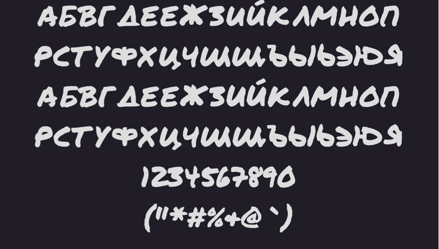

# PermanentMarkerCyrillic

Google Font PermanentMarker with Cyrillic glyphs 

> Permanent marker cyrillic font [Downloand Free](https://github.com/maukur/PermanentMarkerCyrillic/blob/main/PermanentMarker-Regular.otf?raw=true)

---

License

These fonts are licensed under the Apache License, [Version 2.0.](https://www.apache.org/licenses/LICENSE-2.0)
You can use them in your products & projects – print or digital, commercial or otherwise.
This isn't legal advice, please consider consulting a lawyer and see the full license for all details.
